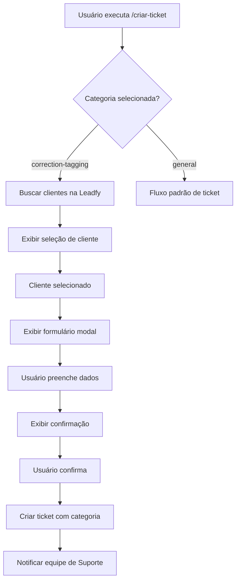

# 🏷️ Correção de Tagueamento - Configuração e Uso

## 📋 Visão Geral

A funcionalidade de **Correção de Tagueamento** é a primeira categoria específica de ticket implementada no sistema. Ela permite que a equipe de tráfego pago crie tickets estruturados para correção de problemas de tagueamento, direcionando automaticamente para a equipe de Suporte.

## 🚀 Como Usar

### 1. Comando Principal

```
/criar-ticket categoria:correção-de-tagueamento
```

### 2. Fluxo Completo

1. **Executar comando** - O usuário executa `/criar-ticket` e seleciona "Correção de Tagueamento"
2. **Seleção de cliente** - Sistema busca clientes na Leadfy e exibe lista interativa
3. **Formulário detalhado** - Usuário preenche informações específicas:
   - Site que precisa de correção
   - Descrição detalhada do problema
   - Informações adicionais (opcional)
   - Time responsável (suporte/cs/trafico)
   - Prioridade (alta/média/baixa)
4. **Confirmação** - Usuário revisa dados antes de confirmar
5. **Criação do ticket** - Sistema cria ticket com categoria específica
6. **Notificação** - Equipe de Suporte é notificada automaticamente

## 🏗️ Arquitetura Implementada

### **Estrutura de Arquivos**

```
src/modules/tickets/categories/
├── ticket-category.interface.ts          # Interfaces base
├── ticket-category.service.ts            # Serviço principal de categorias
├── correction-tagging/
│   ├── correction-tagging.interface.ts   # Dados específicos
│   ├── correction-tagging.service.ts     # Lógica de negócio
│   └── correction-tagging.form.ts        # Formulários Discord
└── index.ts                              # Exports

src/discord/forms/
├── form-handler.service.ts               # Gerenciador de formulários
└── index.ts
```

### **Novos Campos na Entidade Ticket**

```typescript
@Column({ type: 'varchar', length: 100, nullable: true })
categoryId: string;

@Column({ type: 'varchar', length: 500, nullable: true })
website: string;

@Column({ type: 'json', nullable: true })
categoryData: Record<string, any>;
```

## 🔧 Componentes Discord

### **1. Seleção de Cliente**
- Embed com lista de clientes da Leadfy
- Botões interativos para seleção
- Validação automática do cliente

### **2. Formulário Modal**
- **Site**: Campo de texto obrigatório
- **Descrição**: Campo de texto longo obrigatório
- **Informações adicionais**: Campo opcional
- **Time**: Campo de texto (suporte/cs/trafico)
- **Prioridade**: Campo de texto (high/medium/low)

### **3. Confirmação**
- Embed com resumo dos dados
- Botões de confirmação/cancelamento
- Validação final antes da criação

## 📊 Dados do Ticket

### **Estrutura de Dados**

```typescript
interface CorrectionTaggingData {
  clientId: string;
  clientName: string;
  team: string;
  priority: 'low' | 'medium' | 'high';
  website: string;
  problemDescription: string;
  additionalInfo?: string;
}
```

### **Exemplo de Ticket Criado**

```json
{
  "title": "Correção de Tagueamento - Cliente ABC",
  "description": "**Cliente:** Cliente ABC\n**Site:** https://exemplo.com\n**Problema:** Google Analytics não está rastreando conversões\n**Time responsável:** suporte\n**Prioridade:** high",
  "status": "open",
  "priority": "high",
  "categoryId": "correction-tagging",
  "website": "https://exemplo.com",
  "categoryData": {
    "clientId": "123",
    "clientName": "Cliente ABC",
    "team": "suporte",
    "priority": "high",
    "website": "https://exemplo.com",
    "problemDescription": "Google Analytics não está rastreando conversões",
    "additionalInfo": "Problema começou ontem"
  }
}
```

## 🔄 Fluxo de Processamento



## 🎯 Benefícios

### **✅ Para a Equipe de Tráfego**
- Formulário estruturado com campos específicos
- Integração direta com base de clientes Leadfy
- Processo padronizado e eficiente

### **✅ Para a Equipe de Suporte**
- Tickets com informações completas e organizadas
- Contexto claro sobre o problema
- Direcionamento automático correto

### **✅ Para o Sistema**
- Arquitetura escalável para novas categorias
- Dados estruturados e consistentes
- Fácil manutenção e extensão

## 🔧 Configuração Técnica

### **Dependências Adicionadas**
- Nenhuma dependência externa adicional
- Usa estrutura Discord.js existente
- Integra com sistema Leadfy existente

### **Migrations**
- Arquivo de migração criado: `AddTicketCategoryFields.ts`
- Adiciona campos `categoryId`, `website`, `categoryData`
- Compatível com estrutura existente

### **Módulos Atualizados**
- `TicketsModule`: Adicionados novos serviços
- `DiscordModule`: Adicionado FormHandlerService
- `DiscordService`: Integração com sistema de categorias

## 🚀 Próximos Passos

1. **Testar funcionalidade** - Executar comando e verificar fluxo completo
2. **Validar integração Leadfy** - Confirmar busca de clientes
3. **Testar criação de tickets** - Verificar dados salvos no banco
4. **Implementar notificações** - Adicionar notificação para equipe de Suporte
5. **Adicionar novas categorias** - Usar estrutura para outros tipos de ticket

## 🐛 Troubleshooting

### **Problemas Comuns**

1. **Cliente não encontrado**
   - Verificar integração com Leadfy
   - Confirmar sincronização de dados

2. **Formulário não aparece**
   - Verificar permissões do bot
   - Confirmar registro de comandos slash

3. **Ticket não é criado**
   - Verificar logs de erro
   - Confirmar conexão com banco de dados

### **Logs Importantes**

- `Categoria 'correction-tagging' inicializada`
- `Ticket ${id} criado com categoria 'correction-tagging'`
- `Erro no fluxo de correção de tagueamento: ${error}`

---

**Desenvolvido com ❤️ para o Sistema de Tickets Discord**

*Esta funcionalidade representa a primeira implementação do sistema de categorias de tickets, estabelecendo a base para futuras expansões.*
